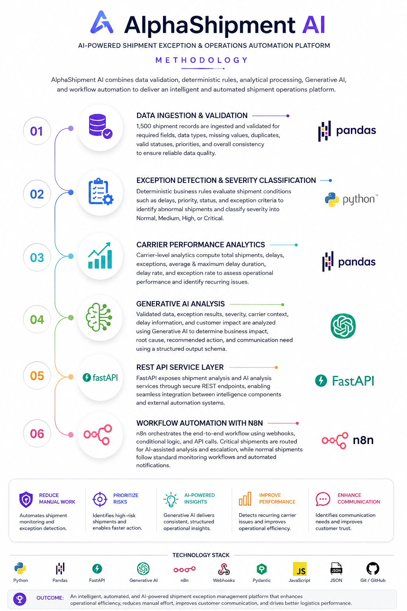

# AlphaShipment AI

## AI-Powered Shipment Exception & Operations Automation Platform

AlphaShipment AI is an AI-powered logistics operations platform designed to intelligently monitor, analyze, and automate shipment operations. The platform combines structured shipment data, data validation, deterministic business rules, carrier performance analytics, Generative AI, FastAPI REST services, and n8n workflow automation to create an end-to-end shipment exception intelligence and operations automation system.

The platform is designed to identify abnormal shipment conditions, classify operational severity, analyze carrier-level performance, generate AI-assisted operational insights, and automatically route critical shipment exceptions toward appropriate escalation and communication workflows.

---

## Methodology

The AlphaShipment AI methodology consists of six connected stages: data ingestion and validation, exception detection and severity classification, carrier performance analytics, Generative AI analysis, REST API service integration, and workflow automation.



The methodology establishes a clear separation between deterministic operational logic, analytical processing, AI reasoning, API services, and workflow orchestration. This allows shipment decisions to remain explainable while using Generative AI for higher-level operational interpretation and recommendations.

### 01. Data Ingestion & Validation

The platform processes a structured dataset of **1,500 shipment records** representing realistic logistics operations. Shipment records contain operational information such as shipment identifiers, origins, destinations, carriers, shipment dates, delivery information, status, priority, delay duration, delay reasons, transportation modes, cargo types, shipment weight, distance, weather conditions, customs status, port congestion, carrier performance information, customer impact, and exception classifications.

A validation layer checks required fields, data types, missing values, duplicate shipment identifiers, valid shipment statuses, valid priority values, numeric delay information, and overall dataset consistency before shipment records enter the operational intelligence pipeline.

This stage establishes reliable and consistent input data for downstream analytics, exception detection, AI analysis, and automation.

### 02. Exception Detection & Severity Classification

The deterministic exception engine evaluates shipment conditions using defined operational business rules. It analyzes factors such as delay duration, shipment priority, shipment status, and exception conditions to identify abnormal shipments.

Detected exceptions are classified according to operational severity:

- **NORMAL**
- **MEDIUM**
- **HIGH**
- **CRITICAL**

The deterministic layer provides consistent and explainable exception decisions before AI analysis is applied. Critical shipment conditions can therefore be identified and prioritized systematically.

### 03. Carrier Performance Analytics

AlphaShipment AI evaluates shipment behavior at the carrier level to provide operational context for individual shipment exceptions.

Carrier analytics calculate metrics including total shipments, delayed shipments, exception counts, average delay hours, maximum delay hours, delay rate, and exception rate.

These measurements allow the platform to identify carriers with recurring operational issues and provide historical performance context when evaluating an individual delayed shipment.

For example, a shipment experiencing a significant delay can be evaluated together with the historical delay rate and average delay duration of its carrier, enabling more context-aware operational analysis.

### 04. Generative AI Analysis

The Generative AI layer converts structured shipment information and operational context into actionable business insights.

The AI analysis considers shipment details, exception type, severity, delay duration, priority, delay reason, carrier performance, and customer impact to generate structured operational intelligence.

The AI produces four primary outputs:

**Business Impact** — explains the operational and customer implications of the shipment exception.

**Root Cause Analysis** — analyzes the recorded delay or exception reason together with relevant operational context.

**Recommended Action** — provides an actionable response for the operations team.

**Customer Communication Required** — determines whether proactive customer communication should be initiated.

The AI output follows a structured schema so that generated insights can be consumed reliably by APIs and downstream automation workflows.

### 05. REST API Service Layer

FastAPI provides the backend REST service layer connecting shipment intelligence components with external automation systems.

The API receives structured shipment information, validates requests, executes shipment exception analysis, invokes AI-assisted analysis, and returns structured operational results.

The REST architecture provides a standardized interface between the Python-based intelligence layer and the n8n automation layer.

Core API capabilities include shipment analysis and AI-assisted shipment analysis through HTTP POST endpoints.

### 06. Workflow Automation with n8n

n8n acts as the workflow orchestration layer for the platform.

Shipment events enter the automation pipeline through webhooks. n8n then communicates with the FastAPI services, receives structured shipment analysis results, evaluates conditional business logic, and routes the shipment according to its operational severity.

Critical shipment exceptions are directed toward AI-assisted operational analysis and escalation workflows, while normal shipment conditions follow standard monitoring workflows.

The workflow architecture enables automated conditional routing, operational escalation, and notification processes without requiring manual intervention for every shipment exception.

---

## End-to-End Architecture

```text
                         ┌───────────────────────────┐
                         │   Shipment Operations      │
                         │      Dataset (1,500)       │
                         └─────────────┬─────────────┘
                                       │
                                       ▼
                         ┌───────────────────────────┐
                         │   Data Ingestion &         │
                         │       Validation           │
                         └─────────────┬─────────────┘
                                       │
                                       ▼
                         ┌───────────────────────────┐
                         │ Exception Detection &     │
                         │ Severity Classification   │
                         └─────────────┬─────────────┘
                                       │
                          ┌────────────┴────────────┐
                          │                         │
                          ▼                         ▼
                ┌───────────────────┐     ┌───────────────────┐
                │ Carrier Performance│     │ Shipment Context  │
                │     Analytics      │     │                   │
                └─────────┬─────────┘     └─────────┬─────────┘
                          │                         │
                          └────────────┬────────────┘
                                       │
                                       ▼
                         ┌───────────────────────────┐
                         │     Generative AI         │
                         │        Analysis           │
                         │                           │
                         │ • Business Impact         │
                         │ • Root Cause Analysis     │
                         │ • Recommended Action      │
                         │ • Customer Communication  │
                         └─────────────┬─────────────┘
                                       │
                                       ▼
                         ┌───────────────────────────┐
                         │        FastAPI REST       │
                         │         Services          │
                         └─────────────┬─────────────┘
                                       │
                                       ▼
                         ┌───────────────────────────┐
                         │          n8n              │
                         │   Workflow Orchestration  │
                         └─────────────┬─────────────┘
                                       │
                         ┌─────────────┴─────────────┐
                         │                           │
                         ▼                           ▼
                ┌──────────────────┐       ┌──────────────────┐
                │ Critical         │       │ Normal /         │
                │ Escalation       │       │ Monitoring       │
                └──────────────────┘       └──────────────────┘
```

---

## Dataset

The platform uses a **1,500-record structured shipment operations dataset** designed to represent diverse logistics scenarios.

The dataset covers shipment and operational attributes including:

- Shipment ID
- Origin and destination
- Carrier
- Shipment date
- Expected and actual delivery information
- Shipment status
- Priority
- Delay hours
- Delay reason
- Transportation mode
- Cargo type
- Shipment weight
- Distance
- Weather conditions
- Customs status
- Port congestion
- Carrier performance
- Customer impact
- Exception type
- Severity

The dataset provides sufficient variation for shipment exception detection, carrier analytics, operational risk assessment, and AI-assisted decision support.

---

## Exception Intelligence

The deterministic exception engine provides explainable operational classification before Generative AI analysis.

A critical exception can contain information such as:

```json
{
  "exception": true,
  "exception_type": "DELIVERY_DELAY",
  "severity": "CRITICAL"
}
```

This structured result becomes an input to the downstream AI and automation layers.

---

## Carrier Analytics

Carrier performance analysis provides operational measurements that support both direct reporting and AI-assisted reasoning.

Example metrics include:

```text
Carrier       Delay Rate     Average Delay
-------------------------------------------
Maersk          47.70%          19.25 hrs
UPS             47.44%          23.17 hrs
DHL             45.63%          18.47 hrs
BlueDart        44.40%          18.89 hrs
Carrier-X       44.12%          16.67 hrs
FedEx           38.93%          18.47 hrs
```

These metrics allow the system to identify recurring carrier-level operational patterns and provide additional context when analyzing individual shipments.

---

## Generative AI Output

AlphaShipment AI uses structured Generative AI analysis to transform shipment and operational information into decision-support outputs.

A typical analysis contains:

```text
Business Impact:
High operational and customer impact caused by a significant shipment delay.

Root Cause Analysis:
The recorded operational reason and relevant carrier context indicate the
primary factors contributing to the shipment exception.

Recommended Action:
Escalate the shipment to the operations team and request an updated
recovery ETA from the carrier.

Customer Communication:
Required when the exception has material customer impact.
```

The structured response is represented through a predefined analysis schema:

```text
AIShipmentAnalysis
│
├── business_impact
├── root_cause_analysis
├── recommended_action
└── customer_communication_required
```

---

## Example Critical Shipment Flow

A high-priority shipment experiencing a significant delivery delay follows the complete intelligence and automation pipeline:

```text
Shipment Event
      ↓
n8n Webhook
      ↓
FastAPI Shipment Analysis
      ↓
Data / Exception Evaluation
      ↓
Critical Severity
      ↓
Carrier Performance Context
      ↓
Generative AI Analysis
      ↓
Business Impact
      ↓
Root Cause Analysis
      ↓
Recommended Action
      ↓
Customer Communication Decision
      ↓
Operations Escalation
```

This allows the platform to move from raw shipment information to an actionable operational decision without requiring manual analysis at every stage.

---

## Business Outcomes

AlphaShipment AI is designed to reduce manual shipment monitoring, identify high-risk shipment exceptions faster, prioritize operational attention, provide consistent AI-assisted operational recommendations, identify recurring carrier performance issues, improve customer communication decisions, and automate repetitive escalation workflows.

The platform demonstrates how deterministic business rules and Generative AI can work together: rules provide consistent and explainable exception classification, analytics provide operational context, AI provides higher-level reasoning and recommendations, FastAPI exposes the intelligence as services, and n8n converts the resulting decisions into automated business workflows.

---

## Technology Stack

| Layer | Technologies |
|---|---|
| Programming | Python, JavaScript |
| Data Processing | Pandas, CSV, JSON |
| Validation | Pandas, Pydantic |
| Backend | FastAPI, REST APIs |
| Generative AI | OpenAI API, structured AI outputs, prompt engineering |
| Automation | n8n, Webhooks, HTTP Request, Conditional Routing |
| Data Format | CSV, JSON |
| Configuration | Environment Variables, `.env` |
| Version Control | Git, GitHub |

---

## Technical Concepts Demonstrated

The project demonstrates practical implementation of:

- End-to-end AI application architecture
- Data ingestion and validation
- Data quality checks
- Deterministic business rules
- Exception detection
- Severity classification
- Operational risk assessment
- Carrier performance analytics
- Delay-rate analysis
- Exception-rate analysis
- Generative AI integration
- Prompt engineering
- Structured LLM outputs
- Root-cause analysis
- AI-assisted recommendations
- REST API development
- FastAPI service architecture
- Pydantic data models
- JSON-based communication
- Webhook-driven architecture
- Conditional workflow routing
- Workflow orchestration
- Automated escalation
- Customer communication decision support
- Modular Python development
- Environment-based configuration
- Git and GitHub version control

---

## Project Structure

```text
AlphaShipment-AI/
│
├── data/
│   └── shipments.csv
│
├── src/
│   ├── ARCHITECTURE/
│   │   └── METHODOLOGY.png
│   │
│   ├── api.py
│   ├── validation.py
│   ├── exception_detection.py
│   ├── carrier_analysis.py
│   ├── ai_schema.py
│   ├── llm_analysis.py
│   ├── shipment_analysis.py
│   ├── test_ai.py
│   └── ...
│
├── .env.example
├── .gitignore
├── requirements.txt
└── README.md
```

---

## Project Architecture at a Glance

```text
                    AlphaShipment AI
                           │
        ┌──────────────────┼──────────────────┐
        │                  │                  │
        ▼                  ▼                  ▼
   Data Layer        Intelligence Layer   Automation
        │                  │                  │
        ▼                  ▼                  ▼
  1,500 Shipments   Exception Detection      n8n
  Validation        Carrier Analytics        Webhooks
  Data Quality      Generative AI            Routing
                    Structured Output        Escalation
        │                  │                  │
        └──────────────────┼──────────────────┘
                           ▼
                 Operational Intelligence
                           │
                           ▼
                 Automated Decision Support
```

---

## Outcome

AlphaShipment AI provides an intelligent and automated shipment exception management platform that combines reliable data processing, explainable operational rules, carrier analytics, Generative AI, REST APIs, and workflow automation to improve logistics operational efficiency, prioritize shipment risks, support faster decisions, automate escalation, and enhance customer communication.
