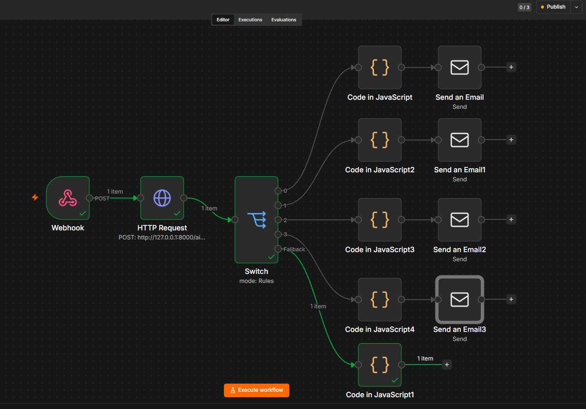

# AlphaShipment AI

## AI-Powered Shipment Exception & Operations Automation Platform

AlphaShipment AI is a logistics AI application that detects shipment exceptions, classifies severity, retrieves relevant operational policies, generates structured AI analysis, and automates operational actions.

The project combines **Python, Pandas, RAG, FAISS, LangChain, LangGraph, OpenAI, Pydantic, FastAPI, n8n, and Docker**.

## What the Project Does

The platform processes **1,500 shipment records**:

```text
Shipment Data
     ↓
Validation
     ↓
Exception Detection
     ↓
Severity Classification
     ↓
RAG Retrieval
     ↓
Generative AI Analysis
     ↓
Pydantic Structured Output
     ↓
Business Guardrails
     ↓
FastAPI
     ↓
n8n Automation
```

Normal shipments stop before the AI stage. Exception shipments continue through RAG and Generative AI analysis.

## Methodology

### 1. Data Validation

Shipment records are validated before entering the intelligence pipeline. The dataset includes shipment IDs, origins, destinations, carriers, status, priority, delay information, transportation mode, cargo, weight, distance, weather, customs, port congestion, customer impact, and exception information.

### 2. Exception Detection

A deterministic Python rule engine uses delay duration, priority, and shipment status to identify exceptions.

Severity levels:

- **NORMAL**
- **MEDIUM**
- **HIGH**
- **CRITICAL**

The deterministic layer provides a consistent and explainable decision before Generative AI is used.

### 3. Carrier Analytics

Carrier-level analytics provide operational context using total shipments, delayed shipments, exception counts, average delay, maximum delay, delay rate, and exception rate.

Historical carrier performance is treated as context, not proof of the cause of an individual shipment exception.

### 4. RAG Pipeline

The RAG pipeline provides operational knowledge to the AI.

Knowledge base documents:

- Shipment operations SOP
- Escalation policy
- Customs procedures
- Carrier policy
- Weather and port disruption policy

The pipeline uses:

- Document ingestion
- Text chunking with LangChain
- OpenAI embeddings
- FAISS vector search
- Top-K retrieval

### 5. LangGraph Workflow

LangGraph orchestrates the workflow:

```text
START
  ↓
Validate
  ↓
Exception Detection
  ↓
Is Exception?
  ├── No → END
  └── Yes
        ↓
      RAG Retrieval
        ↓
      LLM Analysis
        ↓
      Guardrails
        ↓
       END
```

### 6. Generative AI

The AI receives shipment information, the deterministic exception result, and retrieved operational knowledge.

It produces structured outputs containing:

- Business impact
- Root-cause analysis
- Action code
- Recommended action
- Customer communication requirement

### 7. Business Guardrails

AI recommendations are checked against deterministic business rules.

```text
NORMAL
  → MONITOR

MEDIUM
  → MONITOR
  → REQUEST_CARRIER_UPDATE

HIGH
  → ESCALATE_OPERATIONS
  → REQUEST_CARRIER_UPDATE
  → CONTACT_CUSTOMER

CRITICAL
  → ESCALATE_CRITICAL
  → CONTACT_CUSTOMER
```

### 8. FastAPI

FastAPI exposes:

```text
POST /ai-analyze
```

Example request:

```json
{
  "shipment_id": "SHP-1002"
}
```

The API retrieves the shipment, runs the LangGraph workflow, and returns the deterministic analysis, retrieved context, structured AI analysis, and guardrail status.

### 9. n8n Automation

n8n provides workflow orchestration:

```text
Webhook
   ↓
HTTP Request
   ↓
FastAPI /ai-analyze
   ↓
Switch
   ├── ESCALATE_CRITICAL
   ├── ESCALATE_OPERATIONS
   ├── CONTACT_CUSTOMER
   ├── REQUEST_CARRIER_UPDATE
   └── Normal Monitoring
```

Critical exceptions can trigger automated escalation emails.

### 10. Docker

The application is containerized using Docker. The image packages the FastAPI backend, LangGraph workflow, RAG components, FAISS index, knowledge base, and Python dependencies.

The OpenAI API key is supplied at runtime through environment variables rather than stored in the image.

## Architecture

### Methodology


### n8n Automation



## End-to-End Architecture

```text
                         Shipment ID
                              │
                              ▼
                       ┌──────────────┐
                       │ n8n Webhook  │
                       └──────┬───────┘
                              │
                              ▼
                       ┌──────────────┐
                       │   FastAPI    │
                       │ /ai-analyze  │
                       └──────┬───────┘
                              │
                              ▼
                       ┌──────────────┐
                       │ Data Lookup  │
                       └──────┬───────┘
                              │
                              ▼
                  ┌────────────────────────┐
                  │ Exception Detection    │
                  │ & Severity             │
                  └───────────┬────────────┘
                              │
                    ┌─────────┴─────────┐
                    │                   │
                 Normal              Exception
                    │                   │
                    ▼                   ▼
                   END            RAG Retrieval
                                        │
                                        ▼
                                 Generative AI
                                        │
                                        ▼
                                Pydantic Output
                                        │
                                        ▼
                                  Guardrails
                                        │
                                        ▼
                                      n8n
                                        │
                              ┌─────────┴─────────┐
                              │                   │
                         Critical            Other Actions
                              │                   │
                              ▼                   ▼
                      Escalation Email      Workflow Action
```

## RAG Knowledge Base

```text
knowledge_base/
├── operations_sop.md
├── escalation_policy.md
├── customs_procedure.md
├── carrier_policy.md
└── weather_port_policy.md
```

## Evaluation

### Retrieval Evaluation

The RAG pipeline was evaluated across 7 test queries:

```text
Mean Precision@4: 71.43%
Mean Recall@4:    100.00%
```

The expected relevant knowledge sources were retrieved for all test queries, with some additional non-relevant chunks also returned.

### AI Decision Evaluation

The workflow was evaluated across NORMAL, MEDIUM, HIGH, and CRITICAL cases:

```text
Shipments evaluated:          4
Severity accuracy:        100.00%
Action validity:          100.00%
Guardrail pass rate:      100.00%
Structured output validity: 100.00%
```

These results are from the current evaluation set and are not production-scale model accuracy.

## Example Output

```json
{
  "shipment_id": "SHP-1002",
  "exception_analysis": {
    "exception": true,
    "exception_type": "DELIVERY_DELAY",
    "severity": "CRITICAL"
  },
  "ai_analysis": {
    "action_code": "ESCALATE_CRITICAL",
    "customer_communication_required": true
  },
  "guardrails": {
    "passed": true,
    "errors": []
  }
}
```

## Technology Stack

| Area | Technologies |
|---|---|
| Programming | Python, JavaScript |
| Data Processing | Pandas, CSV, JSON |
| Validation | Pydantic |
| AI / LLM | OpenAI API, GPT-5-mini |
| RAG | LangChain, OpenAI Embeddings, FAISS |
| Workflow | LangGraph |
| Backend | FastAPI, REST API |
| Automation | n8n, Webhooks, HTTP Request, Switch, JavaScript, Email |
| Containerization | Docker |
| Version Control | Git, GitHub |

## Project Structure

```text
AlphaShipment-AI/
│
├── data/
│   └── shipments.csv
│
├── knowledge_base/
│   ├── operations_sop.md
│   ├── escalation_policy.md
│   ├── customs_procedure.md
│   ├── carrier_policy.md
│   └── weather_port_policy.md
│
├── src/
│   ├── ARCHITECTURE/
│   │   ├── METHODOLOGY.png
│   │   └── Automation.png
│   ├── rag/
│   │   ├── index.py
│   │   └── retriever.py
│   ├── workflow/
│   │   └── graph.py
│   ├── guardrails/
│   │   └── rules.py
│   ├── api.py
│   ├── ai_schema.py
│   ├── exception_detection.py
│   ├── carrier_analysis.py
│   ├── llm_analysis.py
│   ├── shipment_analysis.py
│   └── validation.py
│
├── evaluation/
│   ├── retrieval_dataset.json
│   ├── evaluate_retrieval.py
│   ├── evaluate_ai_decisions.py
│   └── results.json
│
├── Dockerfile
├── .dockerignore
├── .env.example
├── .gitignore
├── requirements.txt
└── README.md
```

## Running Locally

Install dependencies:

```bash
pip install -r requirements.txt
```

Build the FAISS index:

```bash
python -m src.rag.index
```

Start FastAPI:

```bash
uvicorn src.api:app --reload
```

Open:

```text
http://localhost:8000/docs
```

## Running with Docker

Build the image:

```bash
docker build -t alphashipment-ai .
```

Run the container:

```bash
docker run --rm -p 8000:8000 --env-file .env alphashipment-ai
```

Then open:

```text
http://localhost:8000/docs
```

## Project Goal

AlphaShipment AI demonstrates how deterministic business rules, retrieval-augmented generation, structured LLM outputs, business guardrails, REST APIs, workflow orchestration, and automation can be combined into a practical AI operations application.

The project uses Generative AI where it adds value while keeping critical operational decisions controlled by deterministic business rules.
